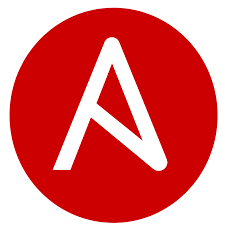

# 👋 Hi, I'm Ahmed Mohamed Daoud  

🚀 **Cloud & DevOps Engineer** with hands-on experience in **AWS, Docker, Kubernetes, Terraform, and Ansible**.  
💡 Passionate about **automating infrastructure**, **building scalable cloud solutions**, and **optimizing IT systems**.  
🌍 Based in Egypt | 💻 Always learning & building new DevOps projects  

---

## 🧰 Tech Stack & Tools

### ☁️ Cloud & Virtualization

  <!-- Cloud -->
  
  
  
  

### ⚙️ DevOps & Automation

  <!-- DevOps -->
  
  
  
  
  
  
  
  
  
  
  
  
  

  
  ### 🌐 Networking & Security
  

  <!-- Networking & Systems -->
  
  

---

### 📂 Featured Projects

#### 🧱 [AWS Infrastructure Setup & Automated Deployment with Ansible](https://github.com/AhmedMoDaoud/AWS-Infrastructure-Setup-and-Automated-Deployment-with-Ansible)
Provision and configure complete AWS infrastructure (VPC, EC2, Security Groups, S3) using Ansible for fully automated, repeatable deployments.

#### ☁️ [Scalable Web Application with ALB & Auto Scaling](https://github.com/AhmedMoDaoud/Scalable-Web-Application-with-ALB-and-Auto-Scaling)
Deploy a scalable, highly available web application using AWS EC2, ALB, ASG, S3, CloudWatch & SNS.

#### ⚙️ [Automated Nginx Deployment with Docker & Ansible](https://github.com/AhmedMoDaoud/Automated-Nginx-Deployment-with-Ansible-Docker)
Automates Nginx deployment inside a Docker container on an AWS EC2 instance using Ansible playbooks.

#### 🖥️ [Automated Server Configuration with Ansible](https://github.com/AhmedMoDaoud/Automated-Server-Configuration-with-Ansible)
Automate provisioning and configuration of Linux servers — installs web servers, manages configs, monitors uptime, and sets up multiple packages.

---

### 🏆 Certifications & Courses
- 🎓 **AWS Cloud Practitioner** — Cloud concepts, EC2, S3, IAM, Networking, Billing  
- 🛡️ **Fortinet Certified Associate in Cybersecurity**  
- 🌐 **CCNA & CCNP ENCOR** — Routing, Switching, IP Services  
- 💾 **MCSA** — Windows Server, Active Directory, Group Policy, DNS, DHCP  
- 💻 **CompTIA A+** — Hardware, Software, and Security Fundamentals  

---

### 🎓 Education
**B.E. in Communications & Electronics Engineering — Assiut University**  
🎯 Final Year Grade: Excellent (91%) | Overall: Very Good with Honors (83.82%)

**Graduation Project:**  
🧠 *Design and Implementation of Neural Networks using FPGAs and ASICs* — Grade: Excellent  

---

### 📊 GitHub Stats

---

### 🌱 Currently Learning
- Terraform (Infrastructure as Code)
- Advanced Kubernetes (Helm, Operators)
- Jenkins & CI/CD Pipelines

---

### 📫 Connect with Me
  
  
  
📧 **Email:** [ahmed.daoud2626@gmail.com](mailto:ahmed.daoud2626@gmail.com)
